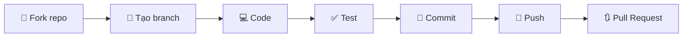

---

<div align="center">

# 🎉 Cảm ơn các Contributor & Hướng dẫn Đóng góp

[](CONTRIBUTING.md)
[](https://conventionalcommits.org)

*Sự đóng góp của bạn làm nên sự khác biệt!*

</div>

---

## 👏 Tri ân các Contributor

<div align="center">

### ✨ Những người đã góp phần xây dựng dự án này ✨

<!-- ALL-CONTRIBUTORS-LIST:START -->
<table>
  <tbody>
    <tr>
      <td align="center" valign="top" width="14.28%">
        <a href="https://github.com/username1">
          
          <br /><sub><b>Contributor 1</b></sub>
        </a>
        <br />
        <a href="#code" title="Code">💻</a>
        <a href="#doc" title="Documentation">📖</a>
      </td>
      <td align="center" valign="top" width="14.28%">
        <a href="https://github.com/username2">
          
          <br /><sub><b>Contributor 2</b></sub>
        </a>
        <br />
        <a href="#bug" title="Bug reports">🐛</a>
        <a href="#ideas" title="Ideas">💡</a>
      </td>
      <!-- Thêm contributors khác tại đây -->
    </tr>
  </tbody>
</table>
<!-- ALL-CONTRIBUTORS-LIST:END -->

</div>

> 💬 **Lời cảm ơn đặc biệt:**
> 
> Chúng tôi muốn gửi lời tri ân sâu sắc đến **tất cả các contributor** đã dành thời gian và công sức để cải thiện dự án này. Mỗi dòng code, mỗi bản fix bug, mỗi cập nhật tài liệu đều đóng góp vào sự phát triển của cộng đồng mã nguồn mở.
>
> *"Alone we can do so little; together we can do so much."* – Helen Keller

### 📊 Thống kê đóng góp

| Loại đóng góp | Emoji | Mô tả |
|:--------------|:-----:|:------|
| Code | 💻 | Viết mã nguồn |
| Documentation | 📖 | Cập nhật tài liệu |
| Bug Reports | 🐛 | Báo cáo lỗi |
| Ideas | 💡 | Đề xuất ý tưởng |
| Review | 👀 | Review code |
| Testing | ⚠️ | Viết test |
| Design | 🎨 | Thiết kế UI/UX |
| Maintenance | 🚧 | Bảo trì dự án |

---

## 📝 Hướng dẫn Chuẩn Commit

Để đảm bảo lịch sử commit **rõ ràng**, **nhất quán** và **dễ theo dõi**, chúng tôi áp dụng chuẩn [**Conventional Commits**](https://www.conventionalcommits.org/).

### 🏗️ Cấu trúc Commit Message

```
<type>(<scope>): <subject>

[body]

[footer]
```

| Thành phần | Bắt buộc | Mô tả |
|:-----------|:--------:|:------|
| `type` | ✅ | Loại thay đổi |
| `scope` | ❌ | Phạm vi ảnh hưởng (module, component) |
| `subject` | ✅ | Mô tả ngắn gọn (≤ 50 ký tự) |
| `body` | ❌ | Giải thích chi tiết (nếu cần) |
| `footer` | ❌ | Breaking changes, issue references |

### 📋 Các loại Commit (Types)

<table>
<thead>
  <tr>
    <th>Type</th>
    <th>Emoji</th>
    <th>Mô tả</th>
    <th>Ví dụ</th>
  </tr>
</thead>
<tbody>
  <tr>
    <td><code>feat</code></td>
    <td>✨</td>
    <td>Thêm tính năng mới</td>
    <td><code>feat(auth): add OAuth2 login support</code></td>
  </tr>
  <tr>
    <td><code>fix</code></td>
    <td>🐛</td>
    <td>Sửa lỗi</td>
    <td><code>fix(api): resolve null pointer exception</code></td>
  </tr>
  <tr>
    <td><code>docs</code></td>
    <td>📚</td>
    <td>Cập nhật tài liệu</td>
    <td><code>docs(readme): add installation guide</code></td>
  </tr>
  <tr>
    <td><code>style</code></td>
    <td>💄</td>
    <td>Format code (không thay đổi logic)</td>
    <td><code>style: apply prettier formatting</code></td>
  </tr>
  <tr>
    <td><code>refactor</code></td>
    <td>♻️</td>
    <td>Tái cấu trúc code</td>
    <td><code>refactor(core): simplify data flow</code></td>
  </tr>
  <tr>
    <td><code>perf</code></td>
    <td>⚡</td>
    <td>Cải thiện hiệu suất</td>
    <td><code>perf(images): implement lazy loading</code></td>
  </tr>
  <tr>
    <td><code>test</code></td>
    <td>✅</td>
    <td>Thêm/sửa test</td>
    <td><code>test(utils): add unit tests for helpers</code></td>
  </tr>
  <tr>
    <td><code>build</code></td>
    <td>📦</td>
    <td>Thay đổi build system</td>
    <td><code>build: upgrade webpack to v5</code></td>
  </tr>
  <tr>
    <td><code>ci</code></td>
    <td>👷</td>
    <td>Cập nhật CI/CD</td>
    <td><code>ci: add automated testing pipeline</code></td>
  </tr>
  <tr>
    <td><code>chore</code></td>
    <td>🔧</td>
    <td>Công việc bảo trì</td>
    <td><code>chore(deps): update dependencies</code></td>
  </tr>
  <tr>
    <td><code>revert</code></td>
    <td>⏪</td>
    <td>Hoàn tác commit trước</td>
    <td><code>revert: revert commit abc123</code></td>
  </tr>
</tbody>
</table>

### 💡 Ví dụ Chi tiết

#### ✅ Commit đúng chuẩn

```bash
# Tính năng mới
feat(shopping-cart): add quantity adjustment buttons

# Sửa lỗi với body giải thích
fix(auth): prevent session timeout during active use

The session was expiring even when users were actively
interacting with the application. This fix implements
a heartbeat mechanism to keep sessions alive.

Closes #142

# Breaking change
feat(api)!: change response format to JSON:API spec

BREAKING CHANGE: API responses now follow JSON:API specification.
Clients need to update their parsing logic accordingly.
```

#### ❌ Commit cần tránh

```bash
# Quá chung chung
fix: bug fix
update: changes

# Không rõ ràng
feat: stuff
chore: misc

# Sai format
FEAT: Add new feature
fix - resolve issue
```

### 🛠️ Công cụ Hỗ trợ

| Công cụ | Mục đích | Cài đặt |
|:--------|:---------|:--------|
| [commitlint](https://commitlint.js.org/) | Kiểm tra format commit | `npm install -g @commitlint/cli` |
| [commitizen](https://commitizen-tools.github.io/commitizen/) | Tạo commit tương tác | `npm install -g commitizen` |
| [husky](https://typicode.github.io/husky/) | Git hooks automation | `npm install -D husky` |

#### Cấu hình nhanh với Commitizen

```bash
# Cài đặt
npm install -g commitizen cz-conventional-changelog

# Sử dụng
git cz
# Thay vì: git commit -m "message"
```

---

## 🚀 Hướng dẫn Đóng góp

### Quy trình đóng góp



### Các bước chi tiết

1. **Fork** repository về tài khoản của bạn
2. **Clone** về máy local
   ```bash
   git clone https://github.com/Trongdepzai-dev/onluyen-scraper-extension.git
   ```
3. **Tạo branch** mới
   ```bash
   git checkout -b feat/amazing-feature
   ```
4. **Commit** theo chuẩn Conventional Commits
5. **Push** lên repository của bạn
   ```bash
   git push origin feat/amazing-feature
   ```
6. Tạo **Pull Request** và chờ review

---

## 📞 Liên hệ & Hỗ trợ

<div align="center">

| Kênh | Link |
|:----:|:----:|
| 💬 Discussions | [GitHub Discussions](link) |
| 🐛 Issues | [Report Bug](link) |
| 📧 Email | [trongha644@gmail.com](mailto:trongha644@gmail.com) |

</div>

---

<div align="center">

### ⭐ Nếu dự án hữu ích, hãy cho chúng tôi một Star!

## Star History

[](https://www.star-history.com/#Trongdepzai-dev/onluyen-scraper-extension&type=date&legend=top-left)
---

**Made with ❤️ by the Community**

</div>

---

