<div align="center">


<br/>

<p align="center">
  <a href="#-tri-ân-các-contributor"></a>
  <a href="https://conventionalcommits.org"></a>
  <a href="#-hướng-dẫn-đóng-góp"></a>
</p>

<br/>

### ✨ *Sự đóng góp của bạn làm nên sự khác biệt!* ✨

</div>


<br/>

## 👏 Tri ân các Contributor

<div align="center">

### 🌟 Những người đã góp phần xây dựng dự án này 🌟

<br/>

<!-- ALL-CONTRIBUTORS-LIST:START -->
<table>
  <tbody>
    <tr>
      <td align="center" valign="top" width="200">
        <a href="https://github.com/Trongdepzai-dev">
          
          <br /><sub><b>🌟 B.Trọng</b></sub>
        </a>
        <br />
        <sub><code>Creator</code></sub>
        <br/><br/>
        <a href="#code" title="Code">💻</a>
        <a href="#doc" title="Documentation">📖</a>
        <a href="#maintenance" title="Maintenance">🚧</a>
      </td>
      <td align="center" valign="top" width="200">
        <a href="https://github.com/KryonBinary">
          
          <br /><sub><b>⚡ KryonBinary</b></sub>
        </a>
        <br />
        <sub><code>Contributor</code></sub>
        <br/><br/>
        <a href="#code" title="Code">💻</a>
        <a href="#ideas" title="Ideas">💡</a>
      </td>
      <!-- Thêm contributors khác tại đây -->
    </tr>
  </tbody>
</table>
<!-- ALL-CONTRIBUTORS-LIST:END -->

</div>

<br/>

> 💬 **Lời cảm ơn đặc biệt:**
> 
> Chúng tôi muốn gửi lời tri ân sâu sắc đến **tất cả các contributor** đã dành thời gian và công sức để cải thiện dự án này. Mỗi dòng code, mỗi bản fix bug, mỗi cập nhật tài liệu đều đóng góp vào sự phát triển của cộng đồng mã nguồn mở.
>
> *"Alone we can do so little; together we can do so much."* – Helen Keller

<br/>

### 📊 Các loại đóng góp

<div align="center">

| Emoji | Loại đóng góp | Mô tả |
|:---:|:---|:---|
| 💻 | **Code** | Viết mã nguồn |
| 📖 | **Documentation** | Cập nhật tài liệu |
| 🐛 | **Bug Reports** | Báo cáo lỗi |
| 💡 | **Ideas** | Đề xuất ý tưởng |
| 👀 | **Review** | Review code |
| ⚠️ | **Testing** | Viết test |
| 🎨 | **Design** | Thiết kế UI/UX |
| 🚧 | **Maintenance** | Bảo trì dự án |

</div>


<br/>

## 📝 Hướng dẫn Chuẩn Commit

<div align="center">

> Để đảm bảo lịch sử commit **rõ ràng**, **nhất quán** và **dễ theo dõi**,
> 
> chúng tôi áp dụng chuẩn [**Conventional Commits**](https://www.conventionalcommits.org/)

</div>

<br/>

### 🏗️ Cấu trúc Commit Message

```
<type>(<scope>): <subject>

[body]

[footer]
```

<div align="center">

| Thành phần | Bắt buộc | Mô tả |
|:---:|:---:|:---|
| `type` | ✅ | Loại thay đổi |
| `scope` | ❌ | Phạm vi ảnh hưởng (module, component) |
| `subject` | ✅ | Mô tả ngắn gọn (≤ 50 ký tự) |
| `body` | ❌ | Giải thích chi tiết (nếu cần) |
| `footer` | ❌ | Breaking changes, issue references |

</div>

<br/>

### 📋 Các loại Commit (Types)

<div align="center">

| Type | Emoji | Mô tả | Ví dụ |
|:---:|:---:|:---|:---|
| `feat` | ✨ | Thêm tính năng mới | `feat(auth): add OAuth2 login` |
| `fix` | 🐛 | Sửa lỗi | `fix(api): resolve null pointer` |
| `docs` | 📚 | Cập nhật tài liệu | `docs(readme): add guide` |
| `style` | 💄 | Format code | `style: apply prettier` |
| `refactor` | ♻️ | Tái cấu trúc code | `refactor(core): simplify flow` |
| `perf` | ⚡ | Cải thiện hiệu suất | `perf: implement lazy loading` |
| `test` | ✅ | Thêm/sửa test | `test(utils): add unit tests` |
| `build` | 📦 | Thay đổi build system | `build: upgrade webpack v5` |
| `ci` | 👷 | Cập nhật CI/CD | `ci: add testing pipeline` |
| `chore` | 🔧 | Công việc bảo trì | `chore(deps): update deps` |
| `revert` | ⏪ | Hoàn tác commit trước | `revert: revert abc123` |

</div>

<br/>

### 💡 Ví dụ Chi tiết

<details>
<summary><b>✅ Click để xem Commit đúng chuẩn</b></summary>

<br/>

```bash
# ✨ Tính năng mới
feat(shopping-cart): add quantity adjustment buttons

# 🐛 Sửa lỗi với body giải thích
fix(auth): prevent session timeout during active use

The session was expiring even when users were actively
interacting with the application. This fix implements
a heartbeat mechanism to keep sessions alive.

Closes #142

# 💥 Breaking change
feat(api)!: change response format to JSON:API spec

BREAKING CHANGE: API responses now follow JSON:API specification.
Clients need to update their parsing logic accordingly.
```

</details>

<details>
<summary><b>❌ Click để xem Commit cần tránh</b></summary>

<br/>

```bash
# ❌ Quá chung chung
fix: bug fix
update: changes

# ❌ Không rõ ràng
feat: stuff
chore: misc

# ❌ Sai format
FEAT: Add new feature
fix - resolve issue
```

</details>

<br/>

### 🛠️ Công cụ Hỗ trợ

<div align="center">

| Công cụ | Mục đích | Cài đặt |
|:---:|:---|:---|
| [commitlint](https://commitlint.js.org/) | Kiểm tra format commit | `npm install -g @commitlint/cli` |
| [commitizen](https://commitizen-tools.github.io/commitizen/) | Tạo commit tương tác | `npm install -g commitizen` |
| [husky](https://typicode.github.io/husky/) | Git hooks automation | `npm install -D husky` |

</div>

<br/>

#### ⚡ Cấu hình nhanh với Commitizen

```bash
# 📦 Cài đặt
npm install -g commitizen cz-conventional-changelog

# 🚀 Sử dụng
git cz
# Thay vì: git commit -m "message"
```


<br/>

## 🚀 Hướng dẫn Đóng góp

<div align="center">

### Quy trình đóng góp

```mermaid
graph LR
    A[🍴 Fork repo] --> B[🌿 Tạo branch]
    B --> C[💻 Code]
    C --> D[✅ Test]
    D --> E[📝 Commit]
    E --> F[🚀 Push]
    F --> G[🔃 Pull Request]
    
    style A fill:#E3F2FD,stroke:#1976D2,stroke-width:2px
    style B fill:#E8F5E9,stroke:#388E3C,stroke-width:2px
    style C fill:#FFF3E0,stroke:#F57C00,stroke-width:2px
    style D fill:#FCE4EC,stroke:#C2185B,stroke-width:2px
    style E fill:#EDE7F6,stroke:#7B1FA2,stroke-width:2px
    style F fill:#E0F7FA,stroke:#0097A7,stroke-width:2px
    style G fill:#FFF8E1,stroke:#FFA000,stroke-width:2px
```



</div>

<br/>

### 📋 Các bước chi tiết

<div align="center">

| Bước | Icon | Hành động | Command |
|:---:|:---:|:---|:---|
| **1** | 🍴 | **Fork** repository | *Click nút Fork trên GitHub* |
| **2** | 📥 | **Clone** về máy | `git clone https://github.com/YOUR_USERNAME/onluyen-scraper-extension.git` |
| **3** | 🌿 | **Tạo branch** mới | `git checkout -b feat/amazing-feature` |
| **4** | 💻 | **Code** tính năng | *Viết code của bạn* |
| **5** | ✅ | **Test** kỹ lưỡng | *Kiểm tra tính năng* |
| **6** | 📝 | **Commit** theo chuẩn | `git commit -m "feat: add amazing feature"` |
| **7** | 🚀 | **Push** lên repo | `git push origin feat/amazing-feature` |
| **8** | 🔃 | Tạo **Pull Request** | *Tạo PR trên GitHub* |

</div>


<br/>

## 📞 Liên hệ & Hỗ trợ

<div align="center">

| Kênh | Mô tả | Link |
|:---:|:---:|:---:|
| 💬 | **Discussions** | [GitHub Discussions](https://github.com/Trongdepzai-dev/onluyen-scraper-extension/discussions) |
| 🐛 | **Issues** | [Report Bug](https://github.com/Trongdepzai-dev/onluyen-scraper-extension/issues) |
| 📧 | **Email** | [trongha644@gmail.com](mailto:trongha644@gmail.com) |

</div>


<br/>

<div align="center">

## ⭐ Star History

<a href="https://star-history.com/#Trongdepzai-dev/onluyen-scraper-extension&Date">
 <picture>
   <source media="(prefers-color-scheme: dark)" srcset="https://api.star-history.com/svg?repos=Trongdepzai-dev/onluyen-scraper-extension&type=Date&theme=dark" />
   <source media="(prefers-color-scheme: light)" srcset="https://api.star-history.com/svg?repos=Trongdepzai-dev/onluyen-scraper-extension&type=Date" />
   
 </picture>
</a>

<br/>

### 🌟 Nếu dự án hữu ích, hãy cho chúng tôi một Star!

<br/>

---

<br/>

**Made with ❤️ by the Community**

<br/>


</div>
