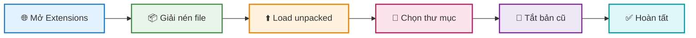

<div align="center">


<br/>

<p align="center">
  
  
  
</p>

<br/>

### 📌 *Hướng dẫn chi tiết cài đặt và cập nhật extension thủ công trên Chrome*

</div>


<br/>

## 📋 Mục Lục

<div align="center">

| # | Nội dung | Mô tả |
|:---:|:---|:---|
| 1️⃣ | [Mở trang Extensions](#-bước-1-mở-trang-extensions) | Truy cập trang quản lý |
| 2️⃣ | [Giải nén file](#-bước-2-giải-nén-file) | Chuẩn bị thư mục |
| 3️⃣ | [Tải tiện ích](#-bước-3-tải-tiện-ích) | Load extension |
| 4️⃣ | [Chọn thư mục](#-bước-4-chọn-thư-mục) | Chọn đúng folder |
| 5️⃣ | [Tắt phiên bản cũ](#-bước-5-tắt-phiên-bản-cũ) | Quản lý version |

</div>


<br/>

## 🚀 Các Bước Thực Hiện

<div align="center">



</div>

<br/>

### 📍 Bước 1: Mở trang Extensions

<div align="center">

> Truy cập vào trang quản lý tiện ích của Chrome

<br/>

```
chrome://extensions/
```

<br/>

💡 **Mẹo:** Copy đường dẫn trên và paste trực tiếp vào thanh địa chỉ của Chrome

</div>


<br/>

### 📍 Bước 2: Giải nén file

<div align="center">

> Giải nén file extension vừa được tải về máy

<br/>

| Định dạng | Cách giải nén | Công cụ |
|:---:|:---|:---:|
| `.zip` | Click chuột phải → **Extract All** | 🪟 Windows |
| `.rar` | Dùng phần mềm giải nén | WinRAR / 7-Zip |
| `.7z` | Dùng phần mềm giải nén | 7-Zip |

</div>


<br/>

### 📍 Bước 3: Tải tiện ích

<div align="center">

| Bước | Hành động |
|:---:|:---|
| 1️⃣ | Bật **Developer mode** ở góc phải trên |
| 2️⃣ | Click nút **"Load unpacked"** |

<br/>

> 🔧 Developer mode cho phép bạn cài đặt extension từ thư mục local

</div>


<br/>

### 📍 Bước 4: Chọn thư mục

<div align="center">

> Chọn đúng thư mục extension

<br/>


</div>

<br/>

> ⚠️ **Lưu ý quan trọng:** 
> 
> Bên trong thư mục chính có thể có **thư mục con cùng tên** → **Double-click** vào thư mục con đó

<br/>


```
📁 extension-folder/
   └── 📁 extension-folder/    ← ✅ Chọn thư mục này
          ├── 📄 manifest.json
          ├── 📁 assets/
          └── ...
```


<br/>

### 📍 Bước 5: Tắt phiên bản cũ

<div align="center">

> Sau khi cài đặt thành công, **tắt phiên bản cũ hơn** để tránh xung đột

<br/>


<br/>

| Phiên bản | Trạng thái | Hành động |
|:---:|:---:|:---|
| `v3.6.3` | ✅ **BẬT** | Phiên bản mới - Giữ nguyên |
| `v3.6.2` | ❌ **TẮT** | Phiên bản cũ - Vô hiệu hóa |

</div>

<br/>

> 🗑️ **Khuyến nghị:** Sau khi xác nhận phiên bản mới hoạt động ổn định, có thể **xóa hoàn toàn** phiên bản cũ


<br/>

## ✅ Hoàn Tất

<div align="center">

### 🎉 Chúc mừng! Extension đã được cập nhật thành công.

<br/>


</div>


<br/>

## ❓ Xử Lý Lỗi Thường Gặp

<div align="center">

| # | Lỗi | Nguyên nhân | Cách khắc phục |
|:---:|:---|:---|:---|
| 1️⃣ | `Manifest file is missing` | Chọn sai thư mục | Chọn thư mục chứa file `manifest.json` |
| 2️⃣ | `Invalid manifest` | File bị lỗi | Tải lại file extension |
| 3️⃣ | Extension không hoạt động | Chưa bật extension | Kiểm tra toggle đã **BẬT** chưa |
| 4️⃣ | Không thấy extension | Chưa bật Developer mode | Bật **Developer mode** ở góc phải |

</div>


<br/>

<div align="center">

### 💬 Có thắc mắc? Hãy tạo Issue để được hỗ trợ!

<br/>

[](../../issues)
[](./README.md)

<br/>

---

<br/>

**Made with ❤️ by Vietnamese Vibe Developers**

<br/>


</div>
