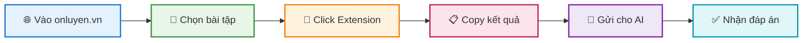

<div align="center">


# ✨ Ôn-Luyện-Scrape ✨

<p align="center">
  <a href="./LICENSE"></a>
  <a href="https://github.com/Trongdepzai-dev/onluyen-scraper-extension"></a>
  <a href="./CONTRIBUTING.md"></a>
  <a href="https://microsoftedge.microsoft.com/addons/detail/jfnjmcpocmkbdknlglbahglkbkjifpde"></a>
</p>

<br/>

### 🎯 Công cụ hỗ trợ học tập thông minh
#### *Tiết kiệm thời gian • Tối ưu hiệu quả • Hoàn toàn miễn phí*

<br/>

<p align="center">
  <a href="#-cài-đặt"></a>
  <a href="#-hướng-dẫn-sử-dụng"></a>
  <a href="#-đóng-góp"></a>
  <a href="#-lộ-trình-phát-triển"></a>
</p>

</div>


<br/>

## 👨‍💻 Đội ngũ phát triển

<div align="center">
  
<table>
  <tr>
    <td align="center" width="200">
      <a href="https://github.com/Trongdepzai-dev">
        
        <br />
        <sub><b>🌟 B.Trọng</b></sub>
        <br />
        <sub><code>Creator</code></sub>
      </a>
    </td>
    <td align="center" width="200">
      <a href="https://github.com/KryonBinary">
        
        <br />
        <sub><b>⚡ KryonBinary</b></sub>
        <br />
        <sub><code>Contributor</code></sub>
      </a>
    </td>
  </tr>
</table>

> 💖 **Tri ân sâu sắc** tới tất cả các contributor! Xem danh sách đầy đủ tại [CONTRIBUTING.md](./CONTRIBUTING.md)

</div>


<br/>

## 📖 Giới thiệu

<div align="center">
  
> **Ôn-Luyện-Scrape** là công cụ giúp bạn tối ưu hóa quá trình học tập và tiết kiệm thời gian.
> 
> Thay vì phải chụp ảnh từng câu hỏi, bạn chỉ cần chọn bài tập và để AI giải quyết nhanh chóng.

</div>

<br/>

### ✨ Tính năng nổi bật

<div align="center">

| | Tính năng | Mô tả |
|:---:|:---:|:---|
| 🚀 | **Nhanh chóng** | Scrape câu hỏi chỉ với **1 click** duy nhất |
| 🤖 | **AI-Ready** | Output tối ưu cho **ChatGPT**, **Claude**, **Gemini** |
| 🔒 | **An toàn** | **Không thu thập** dữ liệu cá nhân |
| 💯 | **Miễn phí** | Mã nguồn mở, **hoàn toàn miễn phí** |

</div>


<br/>

## 🌐 Trình duyệt hỗ trợ

<div align="center">

| Trình duyệt | Trạng thái | Độ khó | Ghi chú |
|:---:|:---:|:---:|:---|
|  | ✅ `Hỗ trợ` | ⭐ Dễ | **🏆 Khuyến nghị** - Cài từ Store |
|  | ✅ `Hỗ trợ` | ⭐⭐ TB | Cài thủ công |

</div>


<br/>

## 📥 Cài đặt

<div align="center">

### Chọn trình duyệt của bạn

</div>

<br/>

### 🔷 Microsoft Edge 

<details>
<summary><b>📋 Click để xem hướng dẫn chi tiết</b></summary>

<br/>

#### 📍 Bước 1: Cài đặt Microsoft Edge

> 💡 Nếu chưa có Edge, tải tại: **[Download Microsoft Edge](https://www.microsoft.com/edge)**

#### 📍 Bước 2: Cài đặt Extension

1. 🔗 Truy cập **[Ôn-Luyện-Scrape trên Edge Add-ons](https://microsoftedge.microsoft.com/addons/detail/jfnjmcpocmkbdknlglbahglkbkjifpde)**
2. 🖱️ Nhấn **"Get"** → **"Add extension"**

<div align="center">

```
✅ Extension đã được Microsoft chứng nhận - An toàn 100%
```

</div>

#### 📍 Bước 3: Sử dụng

| Bước | Hành động |
|:---:|:---|
| 1️⃣ | Truy cập **[app.onluyen.vn](https://app.onluyen.vn/)** |
| 2️⃣ | Chọn bài tập cần giải |
| 3️⃣ | Click icon extension  |
| 4️⃣ | Copy kết quả → Gửi cho AI 🤖 |

</details>

<br/>

### 🔶 Google Chrome

<details>
<summary><b>📋 Click để xem hướng dẫn chi tiết</b></summary>

<br/>

#### 📍 Bước 1: Tải Extension

<div align="center">

[](https://github.com/Trongdepzai-dev/onluyen-scraper-extension/releases/download/Demo/onluyen-scraper-extension.zip)

</div>

#### 📍 Bước 2: Giải nén file

> 🖱️ Click chuột phải → **"Extract All..."** hoặc **"Extract Here"**


#### 📍 Bước 3: Mở trang Extensions

```
chrome://extensions/
```

#### 📍 Bước 4: Bật Developer Mode

> 🔧 Bật toggle **"Developer mode"** ở góc phải trên


#### 📍 Bước 5: Load Extension

1. 🖱️ Click **"Load unpacked"**
2. 📁 Chọn thư mục `onluyen-scraper-extension`


> ⚠️ **Lưu ý:** Nếu trong thư mục có thư mục con cùng tên → Chọn thư mục con đó


#### 📍 Bước 6: Sử dụng

| Bước | Hành động |
|:---:|:---|
| 1️⃣ | Truy cập **[app.onluyen.vn](https://app.onluyen.vn/)** |
| 2️⃣ | Chọn bài tập cần giải |
| 3️⃣ | Click icon extension  |
| 4️⃣ | Copy kết quả → Gửi cho AI 🤖 |

</details>


<br/>

### 🔄 Cập nhật Extension

<div align="center">

| Trình duyệt | Cách cập nhật |
|:---:|:---|
|  | 🔄 **Tự động** cập nhật qua Store |
|  | 📖 [Xem hướng dẫn cập nhật thủ công](./HOW2UPDATE.md) |

</div>


<br/>

## 🎯 Hướng dẫn sử dụng

<div align="center">



</div>

<br/>

### 📋 Quy trình chi tiết

<div align="center">

| Bước | Icon | Hành động | Mô tả |
|:---:|:---:|:---|:---|
| **1** | 🌐 | Truy cập trang | Vào **[app.onluyen.vn](https://app.onluyen.vn/)** |
| **2** | 📝 | Chọn bài tập | Chọn bài tập/đề thi cần giải |
| **3** | 🔌 | Kích hoạt Extension | Click vào icon extension trên toolbar |
| **4** | ⏳ | Đợi xử lý | Extension sẽ scrape nội dung câu hỏi |
| **5** | 📋 | Copy & Paste | Copy kết quả và gửi cho AI |

</div>


<br/>

## 🗺️ Lộ trình phát triển

<div align="center">

### 🔨 Đang phát triển

| # | Tính năng | Mô tả |
|:---:|:---|:---|
| 🤖 | **Tích hợp AI** | Nhận diện và xử lý bài tập phức tạp |
| 📊 | **Hỗ trợ nhiều dạng bài** | Hiển thị nhiều thông tin hơn |
| 🔗 | **Upload lên Chrome Store** | Dễ cập nhật và thao tác đơn giản hơn |

<br/>

### ✅ Đã hoàn thành

| # | Tính năng | Trạng thái |
|:---:|:---|:---:|
| 🔷 | Extension cơ bản cho Edge | ✅ |
| 🔶 | Extension cơ bản cho Chrome | ✅ |
| 📝 | Scrape câu hỏi text | ✅ |
| 🎨 | SVG Icons | ✅ |
| 📊 | Hỗ trợ Table | ✅ |

</div>


<br/>

## 🔒 Bảo mật & Pháp lý

<div align="center">

| | Cam kết | Mô tả |
|:---:|:---:|:---|
| 🛡️ |  | **Không thu thập** bất kỳ dữ liệu cá nhân nào |
| 🔐 |  | **Không chứa** virus, malware hay botnet |
| 📜 |  | **Mã nguồn mở**, tự do sử dụng |

</div>

<br/>

### 🔍 Kiểm tra VirusTotal

<div align="center">


[](https://www.virustotal.com/gui/file/e135158d23b9fe31a62a096a4217994f5ff64405b6d3dc1dc097d9759a88846a/summary)

</div>


<br/>

## 🤝 Đóng góp

<div align="center">

> 🎉 Chúng tôi hoan nghênh mọi đóng góp! Hãy tham gia phát triển dự án:

</div>

```bash
# 🍴 Fork repo
# 🌿 Tạo branch mới
git checkout -b feature/TinhNangMoi

# 💾 Commit changes
git commit -m "✨ Thêm tính năng mới"

# 🚀 Push và tạo Pull Request
git push origin feature/TinhNangMoi
```

<div align="center">

[](./CONTRIBUTING.md)

</div>


<br/>

## 📄 License

<div align="center">

Dự án được phân phối dưới **MIT License**

[](./LICENSE)

</div>


<br/>

<div align="center">

## ⭐ Star History

<a href="https://star-history.com/#Trongdepzai-dev/onluyen-scraper-extension&Date">
 <picture>
   <source media="(prefers-color-scheme: dark)" srcset="https://api.star-history.com/svg?repos=Trongdepzai-dev/onluyen-scraper-extension&type=Date&theme=dark" />
   <source media="(prefers-color-scheme: light)" srcset="https://api.star-history.com/svg?repos=Trongdepzai-dev/onluyen-scraper-extension&type=Date" />
   
 </picture>
</a>

<br/>

### 🌟 Nếu thấy hữu ích, hãy cho chúng tôi một Star!

<br/>

---

<br/>

**📚 Chúc bạn học tốt! ✨**

<br/>

*Made with ❤️ by Vietnamese Vibe Developers & the community*

<br/>


</div>
