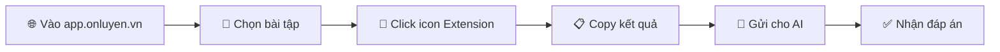

<div align="center">


# 📚 Ôn-Luyện-Scrape

[](./LICENSE)
[](https://github.com/Trongdepzai-dev/onluyen-scraper-extension)
[](./CONTRIBUTING.md)
[](https://microsoftedge.microsoft.com/addons/detail/jfnjmcpocmkbdknlglbahglkbkjifpde)

**Công cụ hỗ trợ học tập thông minh - Tiết kiệm thời gian, tối ưu hiệu quả**

[Cài đặt ngay](#-cài-đặt) • [Hướng dẫn sử dụng](#-hướng-dẫn-sử-dụng) • [Đóng góp](#-đóng-góp) • [Lộ trình](#-lộ-trình-phát-triển)

---

</div>

## 👨‍💻 Tác giả & Đóng góp

<table>
  <tr>
    <td align="center">
      <a href="https://github.com/Trongdepzai-dev">
        <br />
        <sub><b>B.Trọng</b></sub>
      </a>
    </td>
    <td align="center">
      <a href="https://github.com/KryonBinary">
        <br />
        <sub><b>KryonBinary</b></sub>
      </a>
    </td>
  </tr>
</table>

> 💖 **Tri ân sâu sắc** tới tất cả các contributor! Xem danh sách đầy đủ tại [CONTRIBUTING.md](./CONTRIBUTING.md)

---

## 📖 Giới thiệu

**Ôn-Luyện-Scrape** là công cụ giúp bạn tối ưu hóa quá trình học tập và tiết kiệm thời gian. Thay vì phải chụp ảnh từng câu hỏi, bạn chỉ cần chọn bài tập và để AI giải quyết nhanh chóng.

### ✨ Tính năng nổi bật

| Tính năng | Mô tả |
|-----------|-------|
| 🚀 **Nhanh chóng** | Scrape câu hỏi chỉ với 1 click |
| 🤖 **AI-Ready** | Output tối ưu cho các AI như ChatGPT, Claude |
| 🔒 **An toàn** | Không thu thập dữ liệu cá nhân |
| 💯 **Miễn phí** | Mã nguồn mở, hoàn toàn miễn phí |

---

## 🌐 Trình duyệt hỗ trợ

| Trình duyệt | Trạng thái | Độ khó | Ghi chú |
|-------------|------------|--------|---------|
|  | ✅ Hỗ trợ | ⭐ Dễ | **Khuyến nghị** - Cài từ Store |
|  | ✅ Hỗ trợ | ⭐⭐ Trung bình | Cài thủ công |

---

## 📥 Cài đặt

### 🔷 Lựa chọn 1: Microsoft Edge (Khuyến nghị)

<details>
<summary><b>📋 Xem hướng dẫn chi tiết</b></summary>

#### Bước 1: Cài đặt Microsoft Edge

> Nếu chưa có Edge, tải tại: [Download Microsoft Edge](https://www.microsoft.com/edge)

#### Bước 2: Cài đặt Extension

1. Truy cập [Ôn-Luyện-Scrape trên Edge Add-ons](https://microsoftedge.microsoft.com/addons/detail/jfnjmcpocmkbdknlglbahglkbkjifpde)
2. Nhấn **"Get"** → **"Add extension"**

```
✅ Extension đã được Microsoft chứng nhận - An toàn 100%
```

#### Bước 3: Sử dụng

1. Truy cập [app.onluyen.vn](https://app.onluyen.vn/)
2. Chọn bài tập cần giải
3. Click icon extension 
4. Copy kết quả → Gửi cho AI

</details>

---

### 🔶 Lựa chọn 2: Google Chrome

<details>
<summary><b>📋 Xem hướng dẫn chi tiết</b></summary>

#### Bước 1: Tải Extension

[](https://github.com/Trongdepzai-dev/onluyen-scraper-extension/releases/download/Demo/onluyen-scraper-extension.zip)

#### Bước 2: Giải nén file

Click chuột phải → **"Extract All..."** hoặc **"Extract Here"**


#### Bước 3: Mở trang Extensions

Truy cập:
```
chrome://extensions/
```

#### Bước 4: Bật Developer Mode

Bật toggle **"Developer mode"** ở góc phải trên:


#### Bước 5: Load Extension

1. Click **"Load unpacked"**
2. Chọn thư mục `onluyen-scraper-extension`


> ⚠️ **Lưu ý:** Nếu trong thư mục có thư mục con cùng tên → Chọn thư mục con đó


#### Bước 6: Sử dụng

1. Truy cập [app.onluyen.vn](https://app.onluyen.vn/)
2. Chọn bài tập cần giải
3. Click icon extension 
4. Copy kết quả → Gửi cho AI

</details>

---

### 🔄 Cập nhật Extension

| Trình duyệt | Cách cập nhật |
|-------------|---------------|
| **Edge** | Tự động cập nhật qua Store |
| **Chrome** | [📖 Xem hướng dẫn cập nhật thủ công](./HOW2UPDATE.md) |

---

## 🎯 Hướng dẫn sử dụng



### Quy trình chi tiết:

| Bước | Hành động | Mô tả |
|:----:|-----------|-------|
| 1️⃣ | Truy cập trang | Vào [app.onluyen.vn](https://app.onluyen.vn/) |
| 2️⃣ | Chọn bài tập | Chọn bài tập/đề thi cần giải |
| 3️⃣ | Kích hoạt Extension | Click vào icon extension trên toolbar |
| 4️⃣ | Đợi xử lý | Extension sẽ scrape nội dung câu hỏi |
| 5️⃣ | Copy & Paste | Copy kết quả và gửi cho AI (ChatGPT, Claude...) |

---

## 🗺️ Lộ trình phát triển

### Đang phát triển

- [ ] 🤖 **Tích hợp AI** - Nhận diện và xử lý bài tập phức tạp
- [ ] 📊 **Hộ trợ nhiều dạng bài** - Hiển thị nhiều thông tin hơn
- [ ] 🔗 **Upload extension lên chrome** - Dễ cập nhật và thao tác đơn giản hơn

### Hoàn thành

- [x] ✅ Extension cơ bản cho Edge
- [x] ✅ Extension cơ bản cho Chrome
- [x] ✅ Scrape câu hỏi text
- [x] ✅ **SVG Icons** - Thay thế tất cả icons bằng SVG path
- [x] ✅ **Hỗ trợ Table** - Hiển thị dữ liệu dạng bảng

---

## 🔒 Bảo mật & Pháp lý

<table>
  <tr>
    <td>
      
    </td>
    <td>Không thu thập bất kỳ dữ liệu cá nhân nào</td>
  </tr>
  <tr>
    <td>
      
    </td>
    <td>Không chứa virus, malware hay botnet</td>
  </tr>
  <tr>
    <td>
      
    </td>
    <td>Mã nguồn mở, tự do sử dụng</td>
  </tr>
</table>

### Kiểm tra VirusTotal


[](https://www.virustotal.com/gui/file/e135158d23b9fe31a62a096a4217994f5ff64405b6d3dc1dc097d9759a88846a/summary)

---

## 🤝 Đóng góp

Chúng tôi hoan nghênh mọi đóng góp! Hãy tham gia phát triển dự án:

```bash
# Fork repo
# Tạo branch mới
git checkout -b feature/TinhNangMoi

# Commit changes
git commit -m "Thêm tính năng mới"

# Push và tạo Pull Request
git push origin feature/TinhNangMoi
```

Xem thêm tại [CONTRIBUTING.md](./CONTRIBUTING.md)

---

## 📄 License

Dự án được phân phối dưới **MIT License** - Xem [LICENSE](./LICENSE) để biết thêm chi tiết.

---

<div align="center">

### 🌟 Nếu thấy hữu ích, hãy cho chúng tôi một Star!

[](https://www.star-history.com/#Trongdepzai-dev/onluyen-scraper-extension&type=date&legend=top-left)
---

**Chúc bạn học tốt!** 📚✨

*Made with ❤️ by Vietnamese Vibe Developers & the community*

</div>

---
